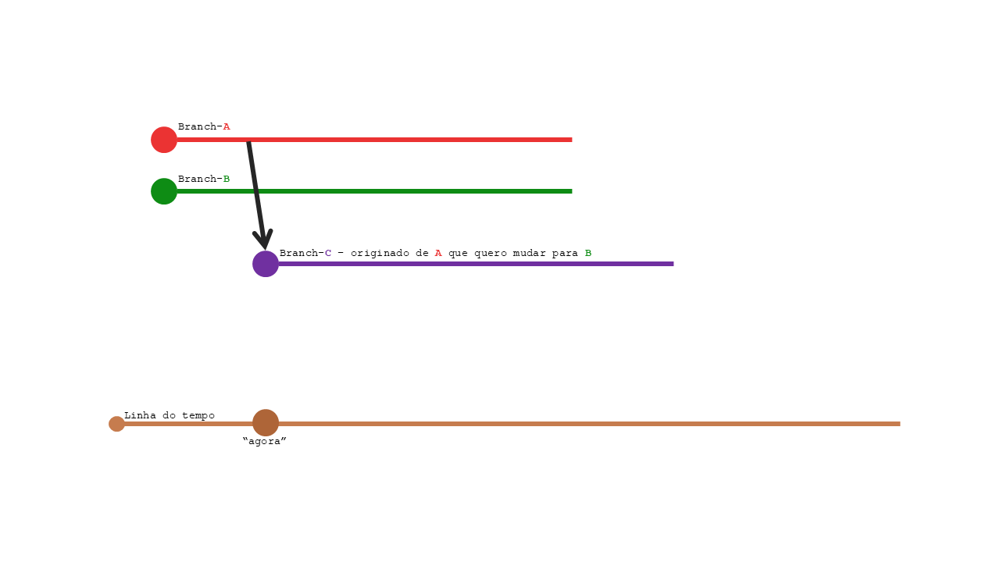
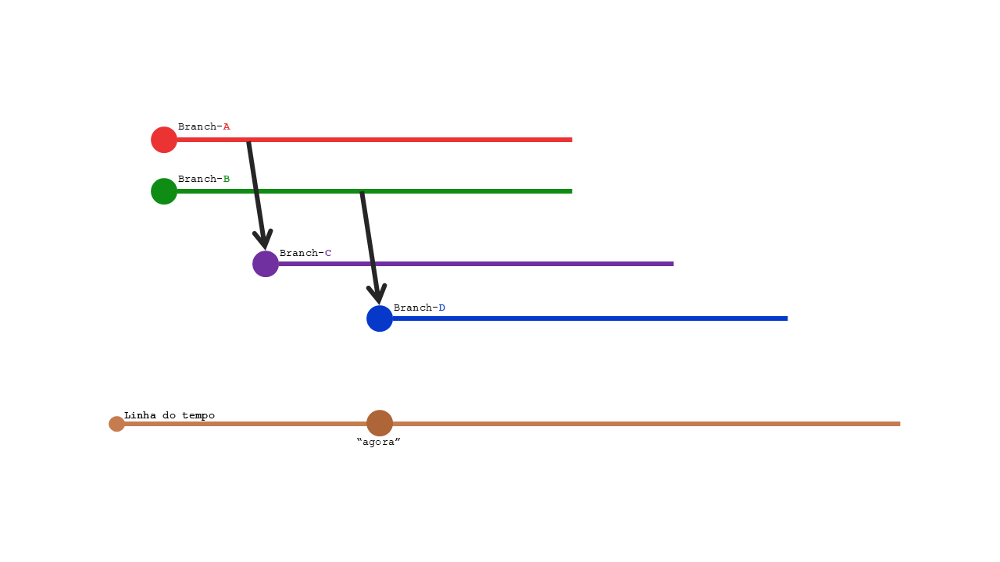
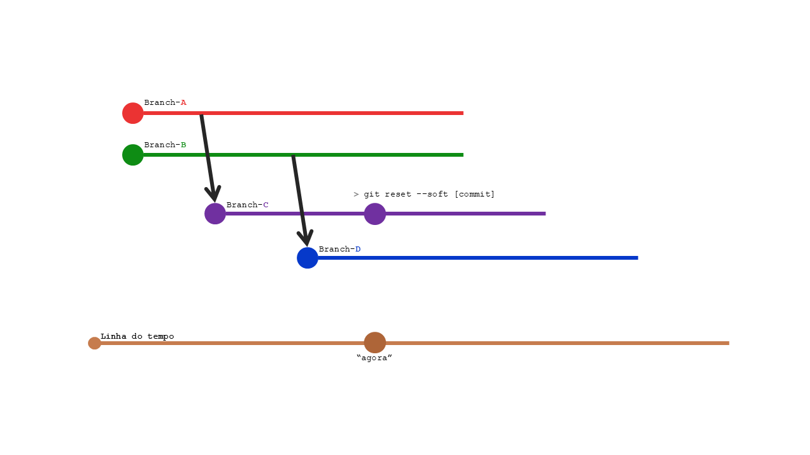
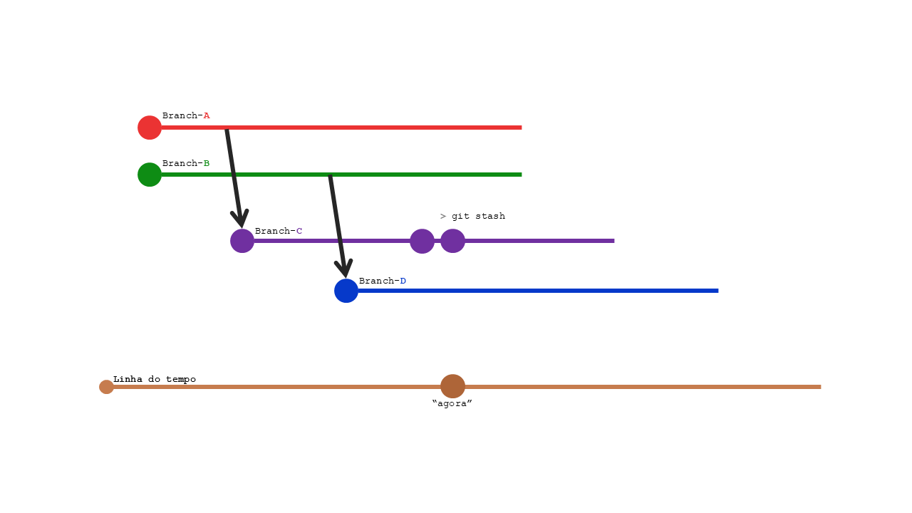
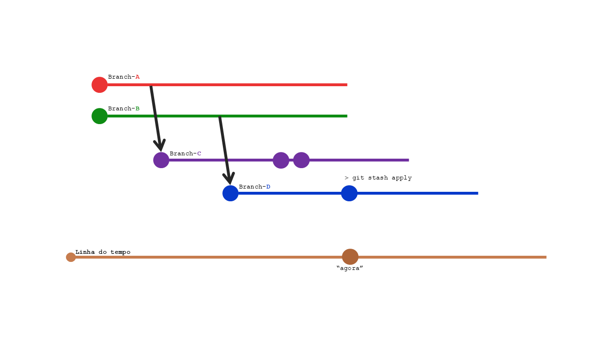
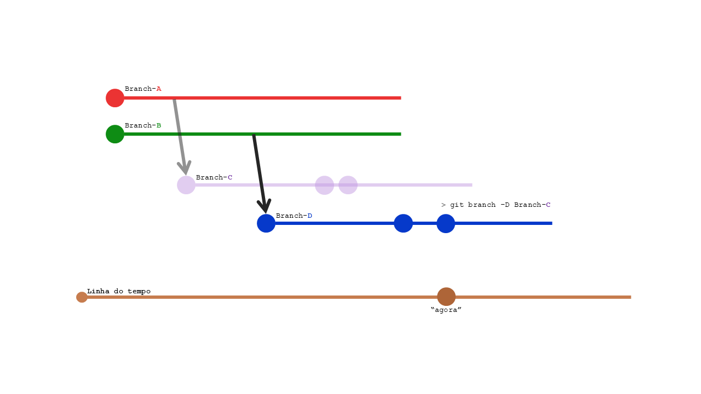

# Como mudar a "branch origem" da minha "branch" atual?

Encontrei uma boa resposta no StackOverflow, só que a explicação não usa comandos e imagens, só texto.

> **StackOverflow pt-br**
>
>  * Pergunta: https://pt.stackoverflow.com/q/375082/111325
>  * Resposta: https://pt.stackoverflow.com/a/375104/111325

Sou muito visual e embora use somente linhas de comando para git, também gosto de exemplos visuais.

Se houvesse uma sequência de comandos, já me ajudaria muito mais rápido.

Resolvi então anotar em um caderno (de papel mesmo), a solução perfeita pra que eu consultasse mais rápido, e estou transferindo pra cá.

## Resposta

Vamos nomear as branchs para evitar confusão:

   * *Branch-A*: originou a sua branch
   * *Branch-B*: branch que será a nova origem
   * *Branch-C*: sua branch, criada a partir da *Branch-A*



Siga os passos:

1. Crie uma branch a partir da *Branch-B* (chamaremos essa branch de *Branch-D*)
  ```
  git checkout Branch-B
  git checkout -b Branch-D
  ```



2. Na *Branch-C*, volte para o último ponto (commit) sem suas alterações:
  ```
  git checkout Branch-C
  git reset –-soft [commit-Id]
  ```



3. Agora salve temporariamente suas alterações:
  ```
  git stash
  ```



4. As alterações que estão salvas, mova para a *Branch-D*. Alguns conflitos podem aparecer, resolva esses conflitos e salve suas alterações.
  ```
  git checkout Branch-D
  git stash apply
  ```
  Se necessário, resolva conflitos
  ```
  git add .
  git commit -m "feat: minhas alterações"
  ```



5. A *Branch-C* pode ser excluída:


