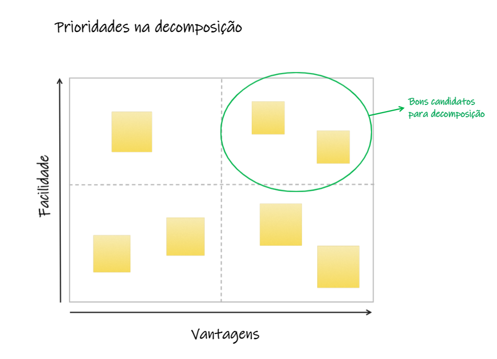
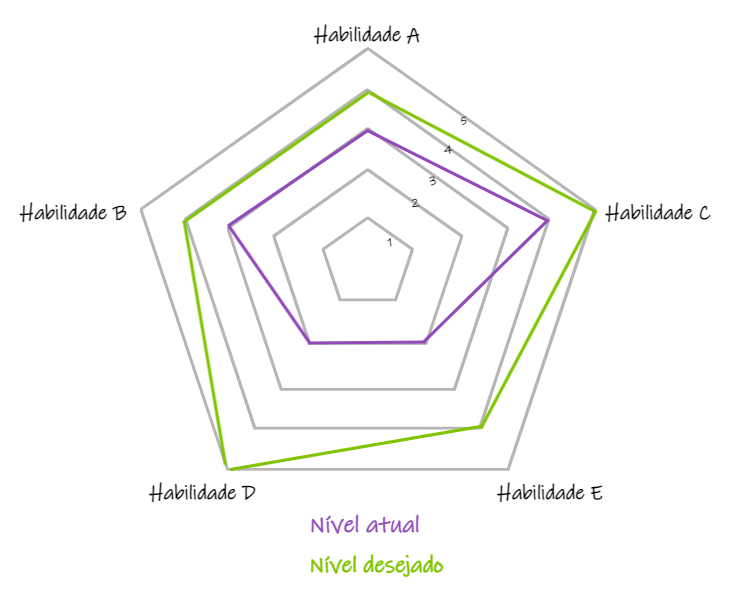

# Migrando sistemas monolíticos para microsserviços - Sam Newman

[Amazon - Migrando Sistemas Monolíticos Para Microsserviços: Padrões Evolutivos Para Transformar seu Sistema Monolítico](https://www.amazon.com.br/Migrando-Sistemas-Monol%C3%ADticos-Para-Microsservi%C3%A7os/dp/6586057043/ref=asc_df_6586057043/?tag=googleshopp00-20&linkCode=df0&hvadid=379739109739&hvpos=&hvnetw=g&hvrand=2762358430000737873&hvpone=&hvptwo=&hvqmt=&hvdev=c&hvdvcmdl=&hvlocint=&hvlocphy=1001729&hvtargid=pla-902269880868&psc=1)

## Prioridades na Decomposição

**Capítulo 2 - Planejando uma migração - Um modelo combinado** - Págs 83 e 84

Modelo visual bom para discussão em equipe, de quais serviços são bons candidatos na decomposição

## Diagrama de Habilidades

**Capítulo 2 - Planejando uma migração - Outras habilidades** - Págs 90, 91 e 92

Pode ser usado individualmente ou em time, para melhorar as habilidades.

No caso do uso em times, cada um pode ter o seu diagrama e o diagrama do time ser uma sobreposição dos gráficos individuais

## Padrões de Decomposição

- [ ] Anotar os padrões prós x contras, é super interessante!!